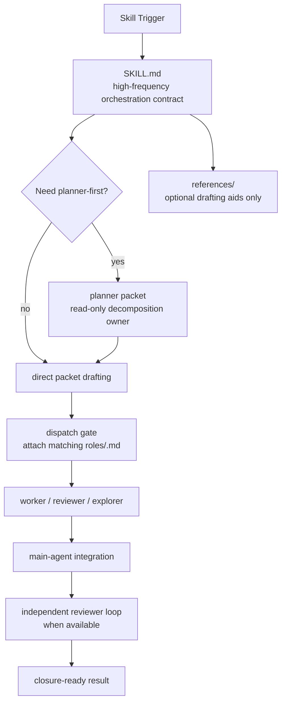

# Main/Sub-Agent Orchestration

[中文说明](./README.zh-CN.md)

This repository contains a Codex skill for planner-first orchestration: the lead agent stays focused on authority, decomposition, dispatch, integration, waiting/recovery judgment, and final closure instead of drifting into being the primary implementer.

## Architecture



## Repository Layout

- `SKILL.md`: the main orchestration contract
- `agents/openai.yaml`: entry metadata and default prompt
- `roles/`: role baselines for `planner`, `worker`, `reviewer`, and `explorer`
- `references/communication-patterns.md`: optional wording aid for handoffs and updates
- `references/worker-packet-template.md`: optional structured packet template

## Core Design Ideas

### 1. Keep high-frequency rules in one place

The main `SKILL.md` owns the runtime rules that the lead agent is most likely to need during real orchestration:

- when planner-first mode is required
- what the main agent may keep locally
- what must be delegated
- how waiting, progress checks, and recovery work
- how review and closure should happen

Lower-frequency aids stay out of the main file unless they directly govern runtime behavior.

### 2. Separate role baselines from the main contract

`roles/*.md` are not duplicated into the main skill body. Each role file carries only the stable baseline for that role:

- `planner`: read-only decomposition and risk judgment
- `worker`: bounded implementation with self-review
- `reviewer`: independent read-only review
- `explorer`: bounded evidence gathering

This keeps the main contract focused while still giving each sub-agent a role-specific baseline when dispatched.

### 3. Make role-doc reading harder to forget

The skill now treats role-document attachment as part of dispatch correctness:

- `agents/openai.yaml` tells the lead agent to attach the matching `roles/<role>.md` path before dispatch
- `SKILL.md` contains a short dispatch gate for role-doc attachment
- packet references remind the lead agent to require read-before-execution

This is meant to reduce drift caused by long context or hand-written packets.

### 4. Use explicit boundaries to reduce role drift

The orchestration contract makes several boundaries explicit:

- planner owns mainline decomposition judgment when planner-first mode is active
- the main agent may do only narrow pre-planner local probing
- once a writable worker is in flight, the main agent should stay in integration-readiness mode instead of designing the next implementation wave
- recovery must be evidence-driven rather than time-driven

These constraints are designed to reduce the common failure modes where the lead agent re-absorbs planning or implementation work.

### 5. Use node triggers as attention-control points

Some critical stages include explicit “state what you are doing now” reminders, for example before dispatch or before recovery decisions.

The goal is not verbosity. The goal is to help the lead agent re-focus on the correct rule at the stage where drift is most likely.

## When To Use This Skill

Use it when the user explicitly wants sub-agents, delegation, or parallel agent work, and wants the lead agent to minimize direct implementation.

It is especially useful when:

- multiple ownership seams exist
- planning burden is high enough to justify a dedicated planner
- independent final review matters
- the lead agent is at risk of absorbing too much context locally

Do not use it for small single-pass tasks or for tightly entangled changes that cannot be split safely.

## Installation

Copy this repository into your Codex skills directory as:

```text
<CODEX_HOME>/skills/main-subagent-orchestration/
```

## Notes

- The skill is repository-agnostic.
- Role documents complement the task packet; they do not replace it.
- The reference files are optional drafting aids, not a second source of truth.
