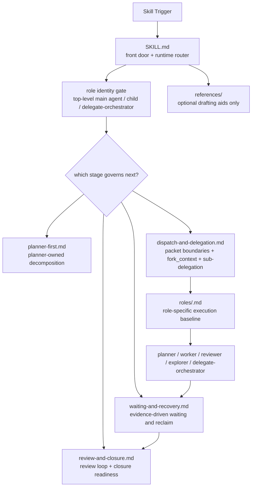

# Main/Sub-Agent Orchestration

[中文说明](./README.zh-CN.md)

This repository packages a Codex skill for planner-first, role-disciplined multi-agent orchestration. The current design treats the lead agent as a top-level orchestrator that owns authority, stage routing, packet boundaries, waiting and recovery judgment, review sequencing, and final closure, while keeping direct implementation local only for genuinely tiny work.

## Architecture



## Repository Layout

```text
main-subagent-orchestration/
  README.md
  README.zh-CN.md
  SKILL.md
  planner-first.md
  dispatch-and-delegation.md
  waiting-and-recovery.md
  review-and-closure.md
  agents/
    openai.yaml
  roles/
    main-agent.md
    planner.md
    worker.md
    reviewer.md
    explorer.md
    delegate-orchestrator.md
  references/
    communication-patterns.md
    worker-packet-template.md
```

## Design Highlights

### 1. The main skill is a router, not a giant monolith

`SKILL.md` now acts as the front door and runtime router. Its job is to:

- determine whether the orchestration workflow is even appropriate
- force an explicit role-identity check before major orchestration actions
- route the current round into the companion document that governs the next stage

This keeps high-frequency runtime attention focused on the current decision instead of mixing planning, dispatch, waiting, and closure into one always-loaded block.

### 2. Role identity is explicit before authority moves

The orchestration model now distinguishes:

- `top-level main agent`
- ordinary delegated children such as `planner`, `worker`, `reviewer`, and `explorer`
- a bounded `delegate-orchestrator`

That role-identity gate is a hard attention-control point. It is there to prevent accidental authority inheritance and to stop delegated children from behaving like a second top-level orchestrator.

### 3. Planner-first is a real stage boundary

When planner-first mode is active, planner owns mainline decomposition judgment. The main agent may still do narrow framing and contradiction checks, but should not silently form a second local implementation plan before planner returns.

This is meant to reduce a common failure mode: the lead agent says “planner-first” but still locally decides packet structure before the planner result arrives.

### 4. Dispatch correctness is treated as a first-class contract

`dispatch-and-delegation.md` makes several boundaries explicit:

- first-layer packets must be mutually exclusive
- `fork_context:false` is the default
- every packet must carry scope, non-goals, ownership, expected deliverable, and escalation path
- role-document attachment is part of packet completeness
- sub-delegation must be explicitly authorized

The goal is to make packet quality something verifiable, not just something hoped for.

### 5. `delegate-orchestrator` is bounded autonomy, not a second main agent

The skill now supports one explicitly bounded local orchestration lane via `delegate-orchestrator`, but only inside a parent packet boundary granted by the top-level main agent.

This gives you a way to hand down a complex internal lane without collapsing the top-level authority model.

### 6. Waiting and recovery are evidence-driven

`waiting-and-recovery.md` is deliberately not timeout-first. Recovery should come from evidence such as:

- explicit blocked status
- tool or environment failure
- packet-shape failure
- repeated low-signal progress loops

This is meant to reduce premature reclaim and the habit of treating long-running work as failed just because it is slow.

### 7. Final review and closure stay separate from worker self-review

Workers must self-review, but worker self-review is not the unified final review. `review-and-closure.md` keeps:

- integration review
- reviewer-loop sequencing
- post-review fix adjudication
- closure readiness
- final broad quality gates

as separate closure-stage concerns owned by the lead agent.

## When To Use This Skill

Use it when the user explicitly wants sub-agents, delegation, or parallel agent work, and wants the lead agent to minimize direct implementation while retaining top-level closure authority.

It is especially useful when:

- multiple ownership seams exist
- planning itself is high-context enough to justify a dedicated planner
- packet boundaries need to stay explicit
- independent final review matters
- the lead agent is at risk of drifting into being the primary implementer

Do not use it for small single-pass tasks or tightly entangled work that cannot be partitioned safely.

## Installation

Copy this repository into your Codex skills directory as:

```text
<CODEX_HOME>/skills/main-subagent-orchestration/
```

## Notes

- The skill is repository-agnostic.
- Companion documents are stage-specific governing surfaces, not extra commentary.
- Role documents complement the task packet; they do not replace it.
- The reference files are optional drafting aids, not a second source of truth.
