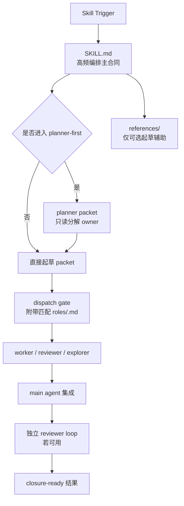

# Main/Sub-Agent Orchestration

[English](./README.md)

这个仓库提供一个面向 Codex 的编排 skill。它的目标不是让主 agent 自己吞下主要实现工作，而是让主 agent 主要负责 authority、分解、派包、集成、等待/回收判断以及最终收口。

## 架构图



## 仓库结构

- `SKILL.md`：主编排合同
- `agents/openai.yaml`：入口元数据与默认提示
- `roles/`：`planner`、`worker`、`reviewer`、`explorer` 的角色基线
- `references/communication-patterns.md`：可选的消息/交接措辞辅助
- `references/worker-packet-template.md`：可选的结构化 packet 模板

## 核心设计思想

### 1. 高频规则集中在主文件

主 `SKILL.md` 只保留真实运行时高频会用到的编排规则：

- 什么时候需要 planner-first
- main agent 哪些工作可以本地做
- 哪些必须委派
- 等待、问询、recovery 怎么判断
- review 和 closure 怎么收口

低频说明不塞进主文件，避免主 skill 变成又长又散的百科。

### 2. 角色基线和主合同分离

`roles/*.md` 不再被主 skill 大段复述。每份角色文档只承载该角色稳定的基线：

- `planner`：只读分解与风险判断
- `worker`：边界内实现与自审
- `reviewer`：独立只读审查
- `explorer`：有界证据收集

这样主合同保持 focused，而 sub-agent 在真正派发时仍然能拿到角色专属约束。

### 3. 把“读角色文档”前移成派包正确性的一部分

现在这条约束不再只是中段提醒：

- `agents/openai.yaml` 会在入口提示 main agent 派包前附上匹配的 `roles/<role>.md`
- `SKILL.md` 里有一个短的 `Role-Doc Dispatch Gate`
- packet 参考模板也要求写明 `read-before-execution`

这样做是为了减少长上下文下主 agent 手写 packet 时漏掉角色文档的概率。

### 4. 用显式边界压住角色漂移

这个 skill 重点强化了几条边界：

- 进入 planner-first 后，planner 是主线分解判断 owner
- planner 返回前，main agent 只能做窄的本地探测
- writable worker 在飞时，main agent 只能保持 integration-readiness，不应提前设计下一波实现
- recovery 必须基于证据，而不是基于“等得不耐烦了”

这些边界就是为了压住你们最近遇到的角色漂移和主 agent 过度本地化问题。

### 5. 用节点触发器做注意力控制

在容易漂移的节点，这个 skill 会要求 agent 显式说出自己当前遵循的关键规则，比如派包前、等待时、回收前。

目的不是让输出变长，而是用很短的显式动作把模型注意力拉回正确规则上。

## 适用场景

当用户明确要求 sub-agent、delegation、parallel agent work，并希望主 agent 尽量少做直接实现时，就适合使用这个 skill。

它尤其适合：

- 存在多个 ownership seam
- 规划负担足够高，值得单独起 planner
- 需要独立最终 review
- 主 agent 很容易本地吞掉过多上下文

如果任务很小、单趟就能做完，或者写面高度纠缠无法安全拆包，就不应该用它。

## 安装

把这个仓库复制到 Codex 的 skills 目录下：

```text
<CODEX_HOME>/skills/main-subagent-orchestration/
```

## 说明

- 这个 skill 不依赖某个具体仓库结构。
- 角色文档是 task packet 的补充，不替代 packet。
- `references/` 只是可选起草辅助，不是第二真相源。
