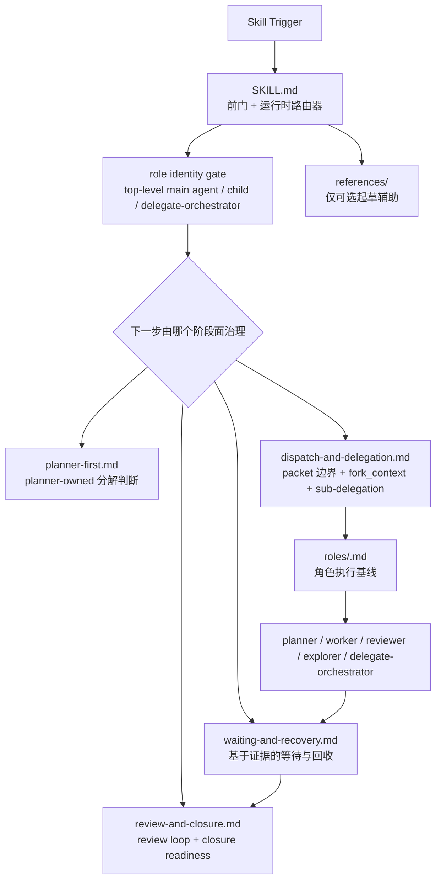

# Main/Sub-Agent Orchestration

[English](./README.md)

这个仓库打包了一个面向 Codex 的编排 skill。当前版本的重点不是“把所有规则塞进一个超长主文件”，而是把主 skill 收成运行时前门与路由器，再把 planner-first、派包、等待回收、review/closure 拆成阶段性 governing surface。

## 架构图



## 仓库结构

```text
main-subagent-orchestration/
  README.md
  README.zh-CN.md
  SKILL.md
  planner-first.md
  dispatch-and-delegation.md
  waiting-and-recovery.md
  review-and-closure.md
  agents/
    openai.yaml
  roles/
    main-agent.md
    planner.md
    worker.md
    reviewer.md
    explorer.md
    delegate-orchestrator.md
  references/
    communication-patterns.md
    worker-packet-template.md
```

## 设计精华

### 1. 主 skill 只做前门与运行时路由

`SKILL.md` 的职责现在很明确：

- 判断这轮任务是否真的该启用编排 skill
- 在重大编排行为前强制做 role identity 判断
- 把当前轮次路由到真正治理下一步动作的 companion 文档

这样高频注意力就集中在当前阶段，而不是把规划、派包、等待、review、closure 全都混在一个常驻大段文本里。

### 2. 先判定“我现在是谁”，再移动 authority

现在这套编排模型会先区分：

- `top-level main agent`
- 普通 delegated child，例如 `planner`、`worker`、`reviewer`、`explorer`
- 有界自治的 `delegate-orchestrator`

这一步的目的就是避免 authority 漂移，防止 child agent 在没有被授权的情况下，行为上变成第二个 top-level orchestrator。

### 3. planner-first 是真实阶段边界，不是口头说法

进入 planner-first 后，主线分解判断 owner 是 planner。main agent 仍然可以做窄的 framing、矛盾探测和 authority 对齐，但不应该在 planner 返回前，自己偷偷把 packet 结构和实现方向基本定完。

这条边界是为了压住常见失真：嘴上说 planner-first，实际上还是 lead agent 本地先把主计划做掉。

### 4. 派包正确性被提升为显式合同

`dispatch-and-delegation.md` 把几类关键边界都写成了显式规则：

- first-layer packet 必须互斥
- `fork_context:false` 是默认规则
- 每个 packet 都必须带 scope、non-goals、ownership、deliverable、escalation path
- 匹配的 `roles/<role>.md` 必须被附上并要求 read-before-execution
- sub-delegation 必须明确授权

这样 packet 质量就不是“凭经验大概对”，而是有结构化检查点。

### 5. `delegate-orchestrator` 是有界自治，不是第二个主 agent

这个 skill 现在支持一条显式授权的 bounded autonomous lane，即 `delegate-orchestrator`。它的用途是：

- 父 packet 边界已经稳定
- 这条 lane 内部还需要再拆 child work
- 但 top-level authority 和最终 closure 仍然留在主 agent

它解决的是“主 agent 不想吞这条复杂 lane，但也不想直接把顶层 authority 交出去”的问题。

### 6. waiting / recovery 以证据为准，不以时间为准

`waiting-and-recovery.md` 刻意避免“等久了就回收”这种时间驱动行为。真正合理的 recovery 证据应该是：

- 明确 blocked
- tool / environment failure
- packet shape 有问题
- 多轮 progress check 后仍然只有低信号重复状态

这就是为了减少“其实还在正常推进，但因为慢就被主 agent 抢回去”的误判。

### 7. worker 自审不等于最终统一 review

worker 必须自审，但 worker self-review 不等于最终 unified review。`review-and-closure.md` 专门把这些 closure 阶段动作单独治理：

- 集成后的 review loop
- reviewer return 之后的 fix adjudication
- closure readiness 判断
- broad quality gates

这样主 agent 才不会把“worker 说自己改好了”误当成完整收口。

## 适用场景

当用户明确要求 sub-agent、delegation、parallel agent work，并希望主 agent 尽量少做直接实现、更多承担 authority 和 closure 职责时，就适合用这个 skill。

它尤其适合：

- 有多个 ownership seam
- 规划本身上下文很重，值得单独起 planner
- packet 边界必须很清晰
- 需要独立最终 review
- main agent 很容易本地吞掉主要实现

如果任务很小、单趟能做完，或者写面高度纠缠无法安全拆包，就不应该用它。

## 安装

把这个仓库复制到 Codex 的 skills 目录下：

```text
<CODEX_HOME>/skills/main-subagent-orchestration/
```

## 说明

- 这个 skill 不依赖某个具体仓库结构。
- companion 文档是阶段性 governing surface，不是解释性附录。
- 角色文档是 task packet 的补充，不替代 packet。
- `references/` 只是可选起草辅助，不是第二真相源。
